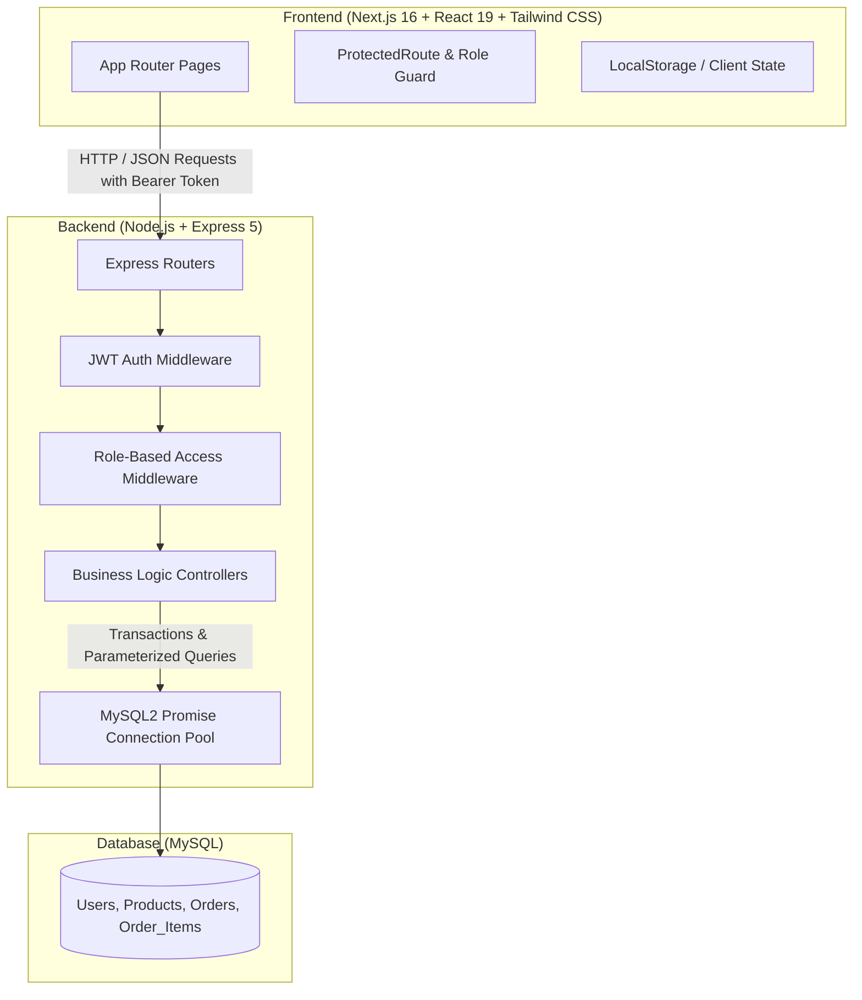
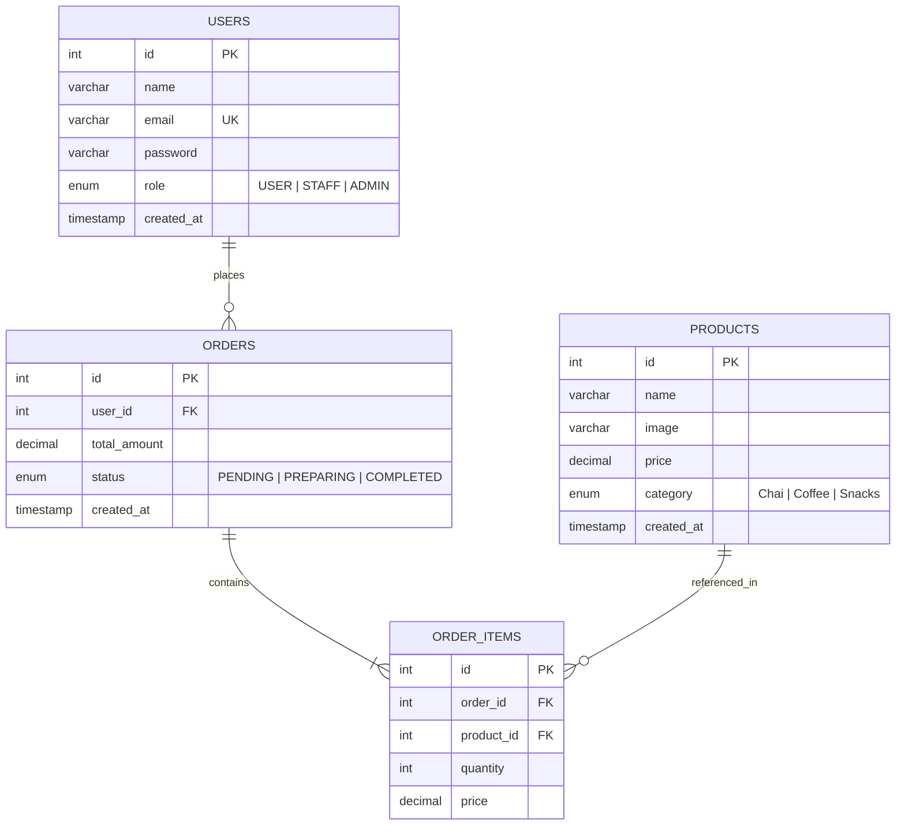

# ☕ Cafe App — Full-Stack Coffee & Tea Ordering System

A modern, responsive, full-stack web application designed for cafes and coffee shops. **Cafe App** allows customers to explore categorized beverage and snack menus, manage a shopping cart, place transactional orders, and track order statuses in real time. It also features a dedicated portal for **Staff** to process incoming orders and an **Admin** suite for complete product inventory management.

---

## 📑 Table of Contents

- [Overview](#-overview)
- [System Architecture](#-system-architecture)
- [Tech Stack](#-tech-stack)
- [Key Features & Role-Based Access (RBAC)](#-key-features--role-based-access-rbac)
- [Database Design & Schema](#-database-design--schema)
- [API Documentation](#-api-documentation)
- [Project Directory Structure](#-project-directory-structure)
- [Getting Started & Local Setup](#-getting-started--local-setup)
  - [Prerequisites](#prerequisites)
  - [1. Database Setup](#1-database-setup)
  - [2. Backend Setup](#2-backend-setup)
  - [3. Frontend Setup](#3-frontend-setup)
- [Security & Architecture Best Practices](#-security--architecture-best-practices)
- [Order Lifecycle State Machine](#-order-lifecycle-state-machine)
- [Future Enhancements](#-future-enhancements)

---

## 🌟 Overview

Cafe App streamlines the digital ordering workflow for beverage outlets:
- **Customers** register, browse freshly curated menus (Chai, Coffee, Snacks), customize cart quantities, and place orders.
- **Baristas / Staff** receive customer orders with live status badges and advance orders through preparation stages.
- **Store Managers / Admins** enjoy full inventory controls (Create, Read, Update, Delete menu items) and can inspect entire order histories.

---

## 🏛 System Architecture

The application adopts a **decoupled Client-Server architecture** with a layered MVC backend and a React Server/Client Component frontend:



### Architectural Highlights
1. **Separation of Concerns**: Controllers isolate business logic from routing, while middleware handles authentication and authorization.
2. **ACID Transaction Integrity**: Order placement executes within a MySQL transaction (`connection.beginTransaction()`) to ensure atomicity across orders and order items; automatic rollback triggers if any item validation or insertion fails.
3. **Stateless Authentication**: Authenticated sessions rely on secure JSON Web Tokens (JWT) signed with expiration times.

---

## 💻 Tech Stack

### Frontend
| Technology | Version | Purpose |
| :--- | :--- | :--- |
| **Next.js** | `16.3.1` (App Router) | React Framework with server & client components |
| **React** | `19.2.8` | Component-based UI library |
| **Tailwind CSS** | `^4.0` | Utility-first CSS styling & responsive layout |
| **Geist Font** | Next Google Fonts | Modern typography optimization |

### Backend
| Technology | Version | Purpose |
| :--- | :--- | :--- |
| **Node.js** | LTS | JavaScript runtime environment |
| **Express.js** | `^5.2.1` | REST API routing and HTTP server |
| **MySQL2** | `^3.23.3` | MySQL client with Promise & Connection Pooling |
| **JSONWebToken** | `^9.0.3` | Token-based stateless authentication |
| **bcrypt** | `^6.0.0` | Salted password hashing |
| **CORS** | `^2.8.6` | Cross-Origin Resource Sharing configuration |
| **dotenv** | `^17.4.2` | Environment variable management |
| **Nodemon** | `^3.1.14` | Hot-reloading development server |

### Database
- **MySQL Server** (`8.0+`) with InnoDB storage engine for foreign key constraints and ACID transactions.

---

## 👥 Key Features & Role-Based Access (RBAC)

The system supports three user roles: `USER`, `STAFF`, and `ADMIN`.

| Feature | Customer (`USER`) | Staff (`STAFF`) | Admin (`ADMIN`) |
| :--- | :---: | :---: | :---: |
| Account Registration & Login | ✅ | ✅ | ✅ |
| Browse Categorized Menu | ✅ | ✅ | ✅ |
| Manage Shopping Cart | ✅ | ✅ | ✅ |
| Place Orders (Transactional) | ✅ | ✅ | ✅ |
| View Personal Order History | ✅ | ✅ | ✅ |
| View All Customer Orders | ❌ | ✅ | ✅ |
| Update Order Status (`PREPARING` / `COMPLETED`) | ❌ | ✅ | ✅ |
| Create New Products | ❌ | ❌ | ✅ |
| Edit Product Price, Category & Image | ❌ | ❌ | ✅ |
| Delete Menu Items | ❌ | ❌ | ✅ |

---

## 🗄 Database Design & Schema

The relational database consists of four core tables:



### SQL Initialization Script

```sql
CREATE DATABASE IF NOT EXISTS cafe_app;
USE cafe_app;

-- 1. Users Table
CREATE TABLE IF NOT EXISTS users (
    id INT AUTO_INCREMENT PRIMARY KEY,
    name VARCHAR(100) NOT NULL,
    email VARCHAR(191) NOT NULL UNIQUE,
    password VARCHAR(255) NOT NULL,
    role ENUM('USER', 'STAFF', 'ADMIN') NOT NULL DEFAULT 'USER',
    created_at TIMESTAMP DEFAULT CURRENT_TIMESTAMP
);

-- 2. Products Table
CREATE TABLE IF NOT EXISTS products (
    id INT AUTO_INCREMENT PRIMARY KEY,
    name VARCHAR(150) NOT NULL,
    image TEXT NULL,
    price DECIMAL(10, 2) NOT NULL,
    category ENUM('Chai', 'Coffee', 'Snacks') NOT NULL,
    created_at TIMESTAMP DEFAULT CURRENT_TIMESTAMP
);

-- 3. Orders Table
CREATE TABLE IF NOT EXISTS orders (
    id INT AUTO_INCREMENT PRIMARY KEY,
    user_id INT NOT NULL,
    total_amount DECIMAL(10, 2) NOT NULL,
    status ENUM('PENDING', 'PREPARING', 'COMPLETED') NOT NULL DEFAULT 'PENDING',
    created_at TIMESTAMP DEFAULT CURRENT_TIMESTAMP,
    CONSTRAINT fk_orders_user FOREIGN KEY (user_id) REFERENCES users(id) ON DELETE CASCADE
);

-- 4. Order Items Table
CREATE TABLE IF NOT EXISTS order_items (
    id INT AUTO_INCREMENT PRIMARY KEY,
    order_id INT NOT NULL,
    product_id INT NOT NULL,
    quantity INT NOT NULL,
    price DECIMAL(10, 2) NOT NULL,
    CONSTRAINT fk_items_order FOREIGN KEY (order_id) REFERENCES orders(id) ON DELETE CASCADE,
    CONSTRAINT fk_items_product FOREIGN KEY (product_id) REFERENCES products(id) ON DELETE CASCADE
);
```

---

## 🔌 API Documentation

Base URL: `http://localhost:5000`

### 1. Authentication Endpoints (`/api/auth`)

#### Register User
- **Method**: `POST`
- **Path**: `/api/auth/register`
- **Access**: Public
- **Request Body**:
  ```json
  {
    "name": "John Doe",
    "email": "john@example.com",
    "password": "secretpassword"
  }
  ```
- **Response `201 Created`**:
  ```json
  {
    "message": "User registered successfully",
    "user": {
      "id": 1,
      "name": "John Doe",
      "email": "john@example.com",
      "role": "USER"
    }
  }
  ```

#### Login User
- **Method**: `POST`
- **Path**: `/api/auth/login`
- **Access**: Public
- **Request Body**:
  ```json
  {
    "email": "john@example.com",
    "password": "secretpassword"
  }
  ```
- **Response `200 OK`**:
  ```json
  {
    "message": "Login successful",
    "token": "eyJhbGciOiJIUzI1NiIsInR5cCI6IkpXVCJ9...",
    "user": {
      "id": 1,
      "name": "John Doe",
      "email": "john@example.com",
      "role": "USER"
    }
  }
  ```

---

### 2. Products Endpoints (`/api/products`)

| Method | Endpoint | Access / Role | Description |
| :--- | :--- | :--- | :--- |
| `GET` | `/api/products` | Public | List all products sorted by category & name |
| `GET` | `/api/products/:id` | Public | Fetch product details by ID |
| `POST` | `/api/products` | `ADMIN` (Bearer Token) | Create a new menu product |
| `PUT` | `/api/products/:id` | `ADMIN` (Bearer Token) | Update product details |
| `DELETE` | `/api/products/:id` | `ADMIN` (Bearer Token) | Remove product from menu |

#### Example: Create Product Payload (`POST /api/products`)
```json
{
  "name": "Caramel Macchiato",
  "price": 180.00,
  "category": "Coffee",
  "image": "https://images.unsplash.com/photo-1485808191679-5f86510681a2"
}
```

---

### 3. Orders Endpoints (`/api/orders`)

| Method | Endpoint | Access / Role | Description |
| :--- | :--- | :--- | :--- |
| `POST` | `/api/orders` | Authenticated (`USER`) | Place order with transaction rollback support |
| `GET` | `/api/orders/my-orders`| Authenticated (`USER`) | Retrieve logged-in user's order history |
| `GET` | `/api/orders` | `STAFF`, `ADMIN` | Fetch all orders with customer details |
| `PATCH`| `/api/orders/:id/status` | `STAFF`, `ADMIN` | Advance order status (`PREPARING` / `COMPLETED`) |

#### Example: Place Order Payload (`POST /api/orders`)
```json
{
  "items": [
    { "product_id": 1, "quantity": 2 },
    { "product_id": 3, "quantity": 1 }
  ]
}
```

#### Example: Update Status Payload (`PATCH /api/orders/1/status`)
```json
{
  "status": "PREPARING"
}
```

---

### 4. Diagnostic & Health Endpoints

- `GET /` — API health check
- `GET /api/db-test` — Verifies MySQL connectivity
- `GET /api/test/user` — Validates Bearer token authentication
- `GET /api/test/staff` — Validates `STAFF` authorization
- `GET /api/test/admin` — Validates `ADMIN` authorization

---

## 📁 Project Directory Structure

```text
cafe-app/
├── client/                     # Next.js Frontend Application
│   ├── app/
│   │   ├── cart/               # Cart page (quantity update, checkout)
│   │   ├── home/               # Hero landing & feature showcase
│   │   ├── items/              # Categorized menu with 'Add to Cart'
│   │   ├── login/              # User authentication page
│   │   ├── register/           # User registration page
│   │   ├── manage-products/    # Admin CRUD suite (Add, Edit, Delete, Search)
│   │   ├── orders/             # Order tracker (Customer / Staff views)
│   │   ├── order-success/      # Post-checkout confirmation screen
│   │   ├── globals.css         # Global styles & Tailwind configuration
│   │   ├── layout.js           # Root layout with fonts & metadata
│   │   └── page.js             # Root redirect to /home
│   ├── components/
│   │   ├── Navbar.js           # Navigation bar with dynamic role links
│   │   └── ProtectedRoute.js   # Client-side Auth & Role route guard
│   ├── package.json
│   └── next.config.mjs
│
├── server/                     # Express.js Backend Application
│   ├── config/
│   │   └── db.js               # MySQL2 connection pool configuration
│   ├── controllers/
│   │   ├── authController.js   # Registration & Login business logic
│   │   ├── productController.js# Product CRUD handlers
│   │   └── orderController.js  # Transactional order placement & status updates
│   ├── middleware/
│   │   ├── authMiddleware.js   # JWT verification middleware
│   │   └── roleMiddleware.js   # RBAC permission checks
│   ├── routes/
│   │   ├── authRoutes.js       # Auth endpoint routes
│   │   ├── productRoutes.js    # Product routes
│   │   ├── orderRoutes.js      # Order routes
│   │   └── testRoutes.js       # Diagnostic routes
│   ├── .env                    # Environment variables (secret)
│   ├── package.json
│   └── server.js               # Express application entry point
│
└── README.md                   # Complete Project Documentation
```

---

## 🚀 Getting Started & Local Setup

### Prerequisites
Make sure the following are installed on your machine:
- **Node.js** (v18.0.0 or later)
- **npm** (v9.0.0 or later)
- **MySQL Server** (v8.0+) running locally on port `3306`

---

### 1. Database Setup

1. Start your local MySQL service.
2. Open MySQL CLI or workbench and execute:
   ```sql
   CREATE DATABASE cafe_app;
   ```
3. Run the schema creation SQL provided in the [Database Design & Schema](#-database-design--schema) section.
4. *(Optional)* Seed initial menu items:
   ```sql
   USE cafe_app;

   INSERT INTO products (name, price, category, image) VALUES
   ('Masala Chai', 30.00, 'Chai', 'https://images.unsplash.com/photo-1576092768241-dec231879fc3'),
   ('Ginger Chai', 35.00, 'Chai', 'https://images.unsplash.com/photo-1544787219-7f47ccb76574'),
   ('Espresso', 90.00, 'Coffee', 'https://images.unsplash.com/photo-1514432324607-a09d9b4aefdd'),
   ('Cappuccino', 120.00, 'Coffee', 'https://images.unsplash.com/photo-1534778101976-62847782c213'),
   ('Veg Puff', 40.00, 'Snacks', 'https://images.unsplash.com/photo-1601050690597-df0568f70950'),
   ('Chocolate Cookie', 50.00, 'Snacks', 'https://images.unsplash.com/photo-1499636136210-6f4ee915583e');
   ```

---

### 2. Backend Setup

1. Open a terminal and navigate to the `server/` directory:
   ```bash
   cd server
   ```
2. Install dependencies:
   ```bash
   npm install
   ```
3. Configure environment variables. Create or check `server/.env`:
   ```env
   PORT=5000
   DB_HOST=localhost
   DB_USER=root
   DB_PASSWORD=your_mysql_password
   DB_NAME=cafe_app
   DB_PORT=3306
   JWT_SECRET=your_super_secret_jwt_key_here
   JWT_EXPIRES_IN=1d
   ```
4. Start the server:
   ```bash
   # Development mode with Nodemon
   npm run dev

   # Production mode
   npm start
   ```
5. Verify server status at `http://localhost:5000/api/db-test`.

---

### 3. Frontend Setup

1. Open a separate terminal and navigate to the `client/` directory:
   ```bash
   cd client
   ```
2. Install dependencies:
   ```bash
   npm install
   ```
3. Start the Next.js development server:
   ```bash
   npm run dev
   ```
4. Open your browser and navigate to:
   ```text
   http://localhost:3000
   ```

---

## 🔒 Security & Architecture Best Practices

- **Password Hashing**: User passwords are encrypted using `bcrypt` with salt rounds before being stored.
- **SQL Injection Prevention**: All queries use parameterized statements (`pool.execute("... WHERE email = ?", [email])`) provided by `mysql2`.
- **JWT Protection**: Secure tokens encode `id` and `role` with an expiration window (`JWT_EXPIRES_IN`).
- **Server-Side Price Validation**: When an order is placed, item prices are fetched directly from the database to prevent client-side price tampering.
- **ACID Transactions**: Order headers and line items are committed as a single unit of work with full rollback protection.
- **Client Route Guards**: `ProtectedRoute` component ensures unauthenticated visitors are redirected to `/login` and non-admin users cannot access administrative views.

---

## 🔄 Order Lifecycle State Machine

Orders adhere to a deterministic state machine enforced at the database controller level:

```
[ PENDING ] ──(Staff accepts order)──> [ PREPARING ] ──(Staff completes order)──> [ COMPLETED ]
```

- **Validation Rules**:
  - `PENDING` orders can only transition to `PREPARING`.
  - `PREPARING` orders can only transition to `COMPLETED`.
  - `COMPLETED` orders are final and immutable.

---

## 🔮 Future Enhancements

- [ ] Real-time order updates via **WebSockets / Socket.io**
- [ ] Online Payment Gateway integration (Stripe / Razorpay)
- [ ] Email / SMS order confirmation notifications
- [ ] Table-side QR Code ordering support
- [ ] Customer order cancellation within grace window
- [ ] Dark Mode UI theme

---

## 📄 License

This project is licensed under the ISC License.
