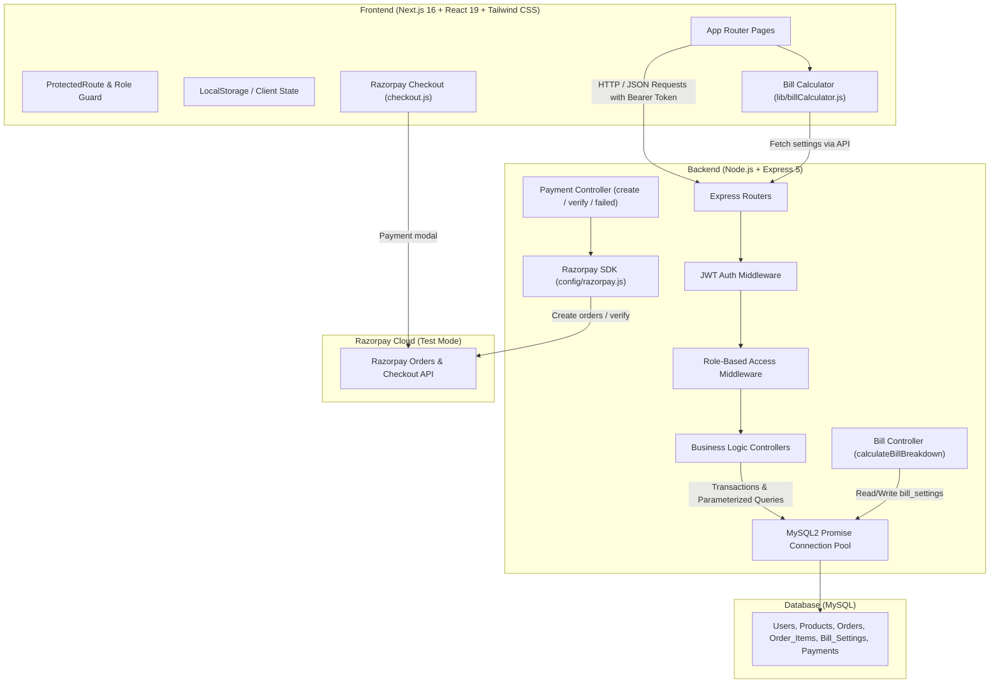
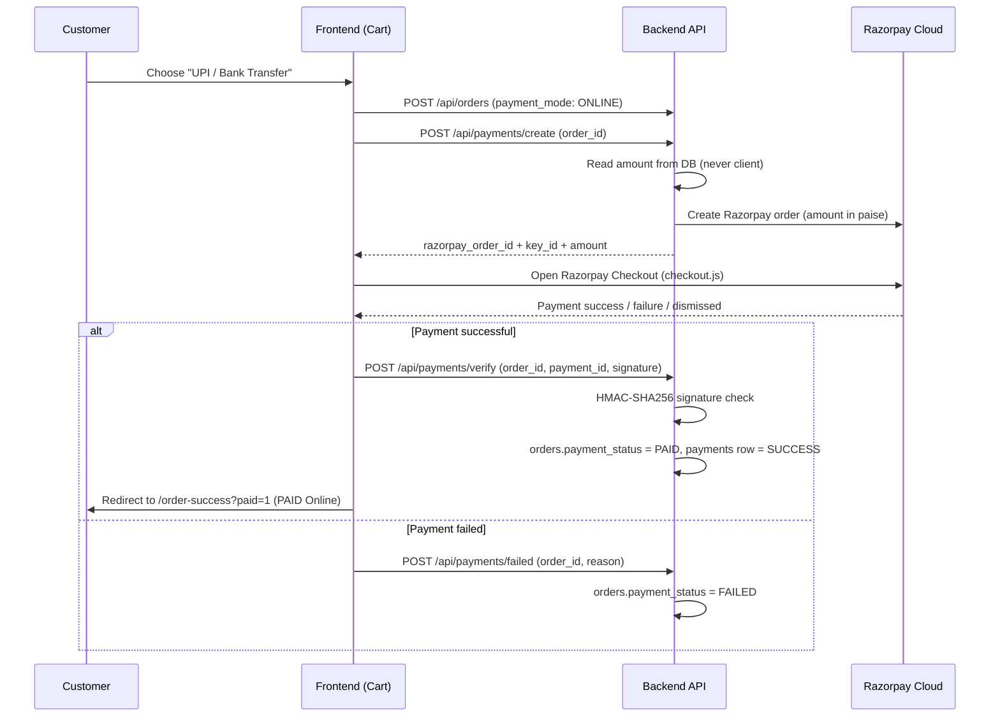
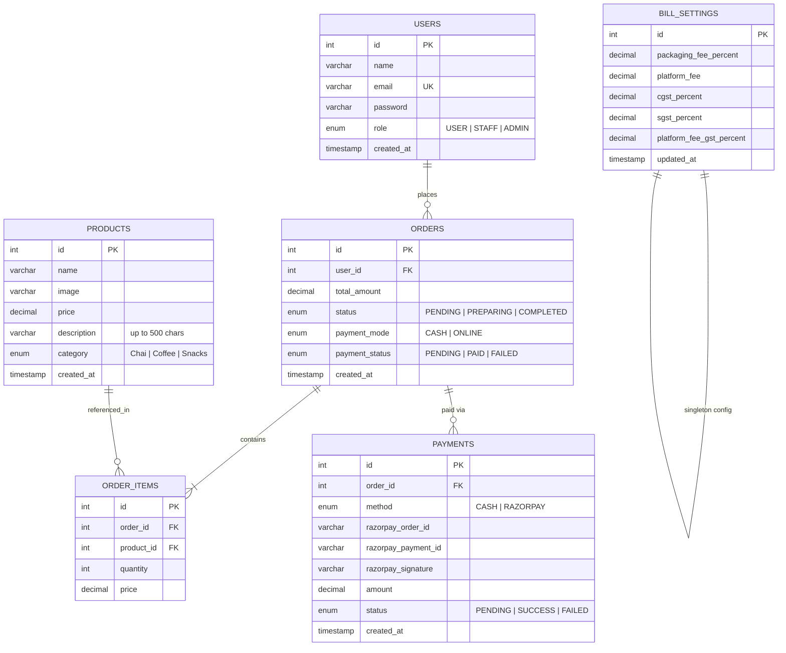
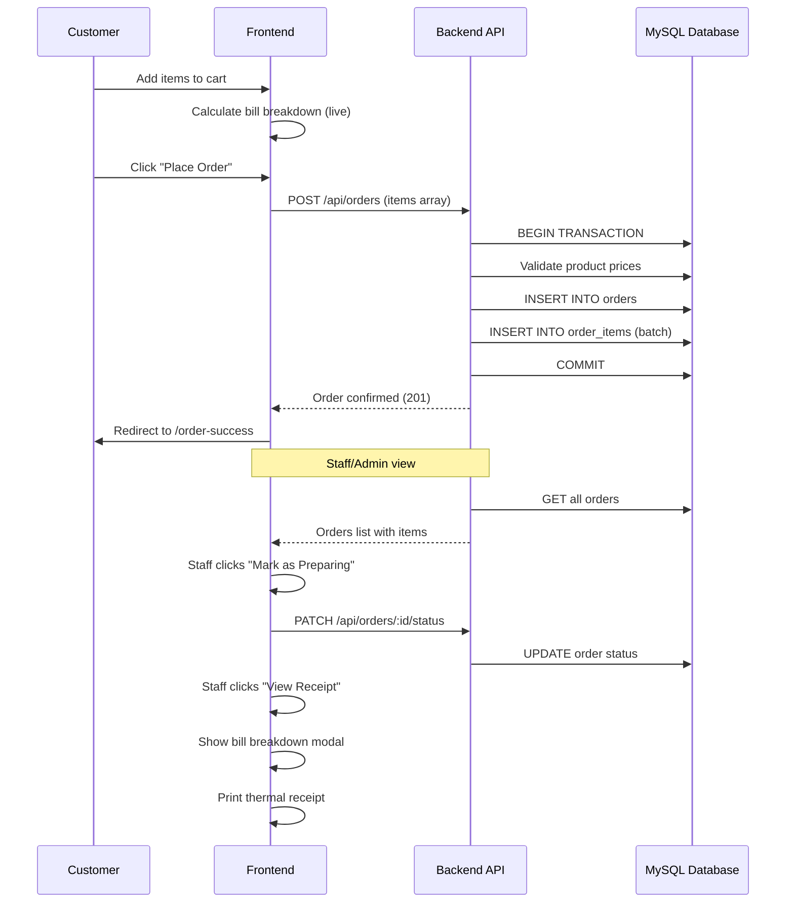

# ☕ Cafe App — Full-Stack Coffee & Tea and Snacks Ordering System

A modern, responsive, full-stack web application designed for cafes and coffee shops. **Cafe App** allows customers to explore categorized beverage and snack menus with rich product descriptions, manage a shopping cart with live bill breakdown, place transactional orders, and pay via **Cash** or **UPI / Bank Transfer (Razorpay)**. It features a dedicated **Staff** portal for processing incoming orders, confirming cash collection, and printing thermal receipts (only for paid orders), plus an **Admin** suite for complete product inventory management and dynamic billing configuration.

---

## 📑 Table of Contents

- [Overview](#-overview)
- [System Architecture](#-system-architecture)
- [Tech Stack](#-tech-stack)
- [Key Features & Role-Based Access (RBAC)](#-key-features--role-based-access-rbac)
- [Billing & Tax Calculation Engine](#-billing--tax-calculation-engine)
- [Payment System (Cash + Razorpay)](#-payment-system-cash--razorpay)
- [Database Design & Schema](#-database-design--schema)
- [API Documentation](#-api-documentation)
- [Project Directory Structure](#-project-directory-structure)
- [Getting Started & Local Setup](#-getting-started--local-setup)
  - [Prerequisites](#prerequisites)
  - [1. Database Setup](#1-database-setup)
  - [2. Backend Setup](#2-backend-setup)
  - [3. Frontend Setup](#3-frontend-setup)
- [Security & Architecture Best Practices](#-security--architecture-best-practices)
- [Order & Payment Lifecycle](#-order--payment-lifecycle)
- [Thermal Receipt Printing](#️-thermal-receipt-printing)
- [Future Enhancements](#-future-enhancements)

---

## 🌟 Overview

Cafe App streamlines the digital ordering workflow for beverage outlets:
- **Customers** register, browse freshly curated menus (Chai, Coffee, Snacks) with product descriptions ("See more" for the full text), customize cart quantities, view a live itemized bill breakdown (including GST, packaging fees, and platform charges), and place orders paid via **Cash** or **UPI / Bank Transfer (Razorpay Checkout)**.
- **Baristas / Staff** receive customer orders with live status badges, advance orders through preparation stages, confirm **cash collection** ("Mark Cash Received"), view detailed receipts with full tax breakdowns, and print thermal bills — available only once an order's payment is settled.
- **Store Managers / Admins** enjoy full inventory controls (Create, Read, Update, Delete menu items with descriptions), can inspect entire order histories with payment status, configure billing parameters (tax rates, packaging fees, platform charges) via a dedicated settings page, and generate printed receipts.

---

## 🏛 System Architecture

The application adopts a **decoupled Client-Server architecture** with a layered MVC backend and a React Server/Client Component frontend:



### Architectural Highlights
1. **Separation of Concerns**: Controllers isolate business logic from routing, while middleware handles authentication and authorization.
2. **ACID Transaction Integrity**: Order placement executes within a MySQL transaction (`connection.beginTransaction()`) to ensure atomicity across orders and order items; automatic rollback triggers if any item validation or insertion fails.
3. **Stateless Authentication**: Authenticated sessions rely on secure JSON Web Tokens (JWT) signed with expiration times.
4. **Dual Bill Calculation**: Bill breakdown logic is mirrored in both the frontend (`lib/billCalculator.js`) and backend (`controllers/billController.js`) to ensure consistent totals across cart, receipts, and order records.
5. **Dynamic Configuration**: Billing parameters (tax rates, fees) are stored in the database and fetched at runtime, allowing admins to update them without code changes.
6. **Trusted Server-Side Payments**: Razorpay order amounts are always read from the database (never the client), and every online payment is confirmed via HMAC-SHA256 signature verification before an order is marked `PAID`.

---

## 💻 Tech Stack

### Frontend
| Technology | Version | Purpose |
| :--- | :--- | :--- |
| **Next.js** | `16.3.1` (App Router) | React Framework with server & client components |
| **React** | `19.2.8` | Component-based UI library |
| **Tailwind CSS** | `^4.0` | Utility-first CSS styling & responsive layout |
| **Geist Font** | Next Google Fonts | Modern typography optimization |

### Backend
| Technology | Version | Purpose |
| :--- | :--- | :--- |
| **Node.js** | LTS | JavaScript runtime environment |
| **Express.js** | `^5.2.1` | REST API routing and HTTP server |
| **MySQL2** | `^3.23.3` | MySQL client with Promise & Connection Pooling |
| **JSONWebToken** | `^9.0.3` | Token-based stateless authentication |
| **Razorpay** | `^2.9.8` | Official Razorpay SDK for online order creation |
| **bcrypt** | `^6.0.0` | Salted password hashing |
| **CORS** | `^2.8.6` | Cross-Origin Resource Sharing configuration |
| **dotenv** | `^17.4.2` | Environment variable management |
| **Nodemon** | `^3.1.14` | Hot-reloading development server |

### Database
- **MySQL Server** (`8.0+`) with InnoDB storage engine for foreign key constraints and ACID transactions.

---

## 👥 Key Features & Role-Based Access (RBAC)

The system supports three user roles: `USER`, `STAFF`, and `ADMIN`.

| Feature | Customer (`USER`) | Staff (`STAFF`) | Admin (`ADMIN`) |
| :--- | :---: | :---: | :---: |
| Account Registration & Login | ✅ | ✅ | ✅ |
| Browse Categorized Menu (with descriptions) | ✅ | ✅ | ✅ |
| Manage Shopping Cart | ✅ | ✅ | ✅ |
| View Live Bill Breakdown in Cart | ✅ | ✅ | ✅ |
| Place Orders — Pay with Cash | ✅ | ✅ | ✅ |
| Place Orders — Pay Online (UPI / Cards via Razorpay) | ✅ | ✅ | ✅ |
| View Personal Order History (with payment status) | ✅ | ✅ | ✅ |
| View All Customer Orders | ❌ | ✅ | ✅ |
| View Order Dashboard Stats (Pending/Preparing/Completed) | ❌ | ✅ | ✅ |
| Update Order Status (`PREPARING` / `COMPLETED`) | ❌ | ✅ | ✅ |
| Mark Cash Payment as Received (`PENDING` → `PAID`) | ❌ | ✅ | ✅ |
| View Receipt with Full Tax Breakdown (paid orders) | ❌ | ✅ | ✅ |
| Print Thermal Bill / Receipt (paid orders only) | ❌ | ✅ | ✅ |
| Create New Products (with description) | ❌ | ❌ | ✅ |
| Edit Product Price, Category, Image & Description | ❌ | ❌ | ✅ |
| Delete Menu Items | ❌ | ❌ | ✅ |
| Configure Bill Settings (Tax Rates, Fees) | ❌ | ❌ | ✅ |

### Page Access Summary

| Page Route | Description | Accessible By |
| :--- | :--- | :--- |
| `/home` | Hero landing & feature showcase | All (public) |
| `/login` | User authentication | All (public) |
| `/register` | User registration | All (public) |
| `/items` | Categorized menu with descriptions & 'Add to Cart' | All (authenticated) |
| `/cart` | Shopping cart with bill breakdown & payment method selection (Cash / UPI) | All (authenticated) |
| `/orders` | Order history, payment status tracking & receipts | All (authenticated, role-filtered views) |
| `/order-success` | Post-checkout confirmation screen | All (authenticated) |
| `/manage-products` | Admin CRUD suite (Add, Edit, Delete, Search) | Admin only |
| `/manage-billing` | Admin bill settings configuration | Admin only |

---

## 💰 Billing & Tax Calculation Engine

The billing system calculates a detailed breakdown of charges for every order. All percentages and fees are **dynamically configurable** by the Admin via the `/manage-billing` page.

### Bill Breakdown Formula

```
┌─────────────────────────────────────────────────────────────────┐
│                     BILL CALCULATION                            │
├─────────────────────────────────────────────────────────────────┤
│                                                                 │
│  Subtotal (Food & Snacks)                                       │
│  = Sum of (item_price × quantity) for all items                 │
│                                                                 │
│  Packaging Fee                                                  │
│  = Subtotal × (packaging_fee_percent / 100)                     │
│  Default: 5% of Subtotal                                        │
│                                                                 │
│  Platform Fee (App Fee)                                         │
│  = Fixed amount (default: ₹5.00)                                │
│                                                                 │
│  CGST                                                           │
│  = (Subtotal + Packaging Fee) × (cgst_percent / 100)            │
│  Default: 2.5%                                                  │
│                                                                 │
│  SGST                                                           │
│  = (Subtotal + Packaging Fee) × (sgst_percent / 100)            │
│  Default: 2.5%                                                  │
│                                                                 │
│  GST on Platform Fee                                            │
│  = Platform Fee × (platform_fee_gst_percent / 100)              │
│  Default: 18%                                                   │
│                                                                 │
│  Calculated Total                                               │
│  = Subtotal + Packaging Fee + Platform Fee                      │
│    + CGST + SGST + GST on Platform Fee                          │
│                                                                 │
│  Rounding Off Adjustment                                        │
│  = Math.ceil(Calculated Total) - Calculated Total               │
│                                                                 │
│  Grand Total (Payable)                                          │
│  = Math.ceil(Calculated Total)                                  │
│                                                                 │
└─────────────────────────────────────────────────────────────────┘
```

### Default Bill Settings

| Parameter | Default Value | Description |
| :--- | :--- | :--- |
| `packaging_fee_percent` | `5.0%` | Percentage of subtotal charged as packaging fee |
| `platform_fee` | `₹5.00` | Fixed platform/app usage fee per order |
| `cgst_percent` | `2.5%` | Central GST applied on (Subtotal + Packaging Fee) |
| `sgst_percent` | `2.5%` | State GST applied on (Subtotal + Packaging Fee) |
| `platform_fee_gst_percent` | `18.0%` | GST applied on the Platform Fee |

### Rounding Rules
- Each individual line item (CGST, SGST, Packaging Fee, etc.) is rounded to **2 decimal places** before summing.
- The `Calculated Total` is the sum of all rounded line items.
- The `Grand Total` is the `Calculated Total` rounded **up** to the next integer (using `Math.ceil()`).
- The `Rounding Off Adjustment` shows the difference between Grand Total and Calculated Total.

### Calculation Consistency
The calculation logic is **mirrored** in two locations to ensure the frontend cart view and the backend order processing always produce identical totals:

| Location | File | Purpose |
| :--- | :--- | :--- |
| **Frontend** | `client/lib/billCalculator.js` | Real-time cart breakdown & receipt modal display |
| **Backend** | `server/controllers/billController.js` | Server-side order validation & receipt generation |

Both implementations fetch live settings from the `bill_settings` database table at runtime.

### Example Calculation

For an order with Subtotal = ₹165.00 and default settings:

| Component | Calculation | Amount |
| :--- | :--- | :--- |
| Subtotal | — | ₹165.00 |
| Packaging Fee (5%) | 165.00 × 0.05 | ₹8.25 |
| Platform Fee | Fixed | ₹5.00 |
| CGST (2.5%) | (165.00 + 8.25) × 0.025 | ₹4.33 |
| SGST (2.5%) | (165.00 + 8.25) × 0.025 | ₹4.33 |
| GST on Platform Fee (18%) | 5.00 × 0.18 | ₹0.90 |
| **Calculated Total** | Sum of all above | **₹187.81** |
| Rounding Off | ceil(187.81) - 187.81 | +₹0.19 |
| **Grand Total** | ceil(187.81) | **₹188.00** |

---

## 💳 Payment System (Cash + Razorpay)

After clicking **Place Order** on the cart page, the customer chooses a payment method from a modal:

### 1) Pay with Cash
- The order is created with `payment_mode = CASH` and `payment_status = PENDING` (pay at the counter).
- Staff/Admin see a **"💵 Mark Cash Received"** button on unpaid cash orders in the Orders page.
- Clicking it calls `PATCH /api/orders/:id/payment-status`, which flips `payment_status` to `PAID` (one-way, and only for cash orders) and logs the collection in the `payments` table.

### 2) UPI / Bank Transfer (Razorpay)


### Security Rules
- The payable amount is **always read from the database** (converted to paise server-side) — the client can never set it.
- Every payment endpoint requires a valid **JWT**, and users can only pay for **their own** orders (ownership checks).
- The final trust decision is **server-side signature verification**: `HMAC_SHA256(razorpay_order_id + "|" + razorpay_payment_id, RAZORPAY_KEY_SECRET)`.
- Receipt printing is **locked** until `payment_status = PAID`.

> Detailed flow documentation also lives in [`payment.md`](payment.md).

---

## 🗄 Database Design & Schema

The relational database consists of **six** core tables:



### SQL Initialization Script

```sql
CREATE DATABASE IF NOT EXISTS cafe_app;
USE cafe_app;

-- 1. Users Table
CREATE TABLE IF NOT EXISTS users (
    id INT AUTO_INCREMENT PRIMARY KEY,
    name VARCHAR(100) NOT NULL,
    email VARCHAR(191) NOT NULL UNIQUE,
    password VARCHAR(255) NOT NULL,
    role ENUM('USER', 'STAFF', 'ADMIN') NOT NULL DEFAULT 'USER',
    created_at TIMESTAMP DEFAULT CURRENT_TIMESTAMP
);

-- 2. Products Table
CREATE TABLE IF NOT EXISTS products (
    id INT AUTO_INCREMENT PRIMARY KEY,
    name VARCHAR(150) NOT NULL,
    image TEXT NULL,
    price DECIMAL(10, 2) NOT NULL,
    category ENUM('Chai', 'Coffee', 'Snacks') NOT NULL,
    created_at TIMESTAMP DEFAULT CURRENT_TIMESTAMP
);

-- 3. Orders Table
CREATE TABLE IF NOT EXISTS orders (
    id INT AUTO_INCREMENT PRIMARY KEY,
    user_id INT NOT NULL,
    total_amount DECIMAL(10, 2) NOT NULL,
    status ENUM('PENDING', 'PREPARING', 'COMPLETED') NOT NULL DEFAULT 'PENDING',
    created_at TIMESTAMP DEFAULT CURRENT_TIMESTAMP,
    CONSTRAINT fk_orders_user FOREIGN KEY (user_id) REFERENCES users(id) ON DELETE CASCADE
);

-- 4. Order Items Table
CREATE TABLE IF NOT EXISTS order_items (
    id INT AUTO_INCREMENT PRIMARY KEY,
    order_id INT NOT NULL,
    product_id INT NOT NULL,
    quantity INT NOT NULL,
    price DECIMAL(10, 2) NOT NULL,
    CONSTRAINT fk_items_order FOREIGN KEY (order_id) REFERENCES orders(id) ON DELETE CASCADE,
    CONSTRAINT fk_items_product FOREIGN KEY (product_id) REFERENCES products(id) ON DELETE CASCADE
);

-- 5. Bill Settings Table (auto-created by the server on first run)
CREATE TABLE IF NOT EXISTS bill_settings (
    id INT PRIMARY KEY AUTO_INCREMENT,
    packaging_fee_percent DECIMAL(5, 2) NOT NULL DEFAULT 5.00,
    platform_fee DECIMAL(10, 2) NOT NULL DEFAULT 5.00,
    cgst_percent DECIMAL(5, 2) NOT NULL DEFAULT 2.50,
    sgst_percent DECIMAL(5, 2) NOT NULL DEFAULT 2.50,
    platform_fee_gst_percent DECIMAL(5, 2) NOT NULL DEFAULT 18.00,
    updated_at TIMESTAMP DEFAULT CURRENT_TIMESTAMP ON UPDATE CURRENT_TIMESTAMP
);

-- Insert default bill settings (singleton row)
INSERT INTO bill_settings
    (id, packaging_fee_percent, platform_fee, cgst_percent, sgst_percent, platform_fee_gst_percent)
VALUES
    (1, 5.00, 5.00, 2.50, 2.50, 18.00)
ON DUPLICATE KEY UPDATE id = id;
```

> **Note**: The `bill_settings` table is automatically created and seeded by the server (`billController.js`) on first API access, so manual creation is optional.

---

## 🔌 API Documentation

Base URL: `http://localhost:5000`

### 1. Authentication Endpoints (`/api/auth`)

#### Register User
- **Method**: `POST`
- **Path**: `/api/auth/register`
- **Access**: Public
- **Request Body**:
  ```json
  {
    "name": "John Doe",
    "email": "john@example.com",
    "password": "secretpassword"
  }
  ```
- **Response `201 Created`**:
  ```json
  {
    "message": "User registered successfully",
    "user": {
      "id": 1,
      "name": "John Doe",
      "email": "john@example.com",
      "role": "USER"
    }
  }
  ```

#### Login User
- **Method**: `POST`
- **Path**: `/api/auth/login`
- **Access**: Public
- **Request Body**:
  ```json
  {
    "email": "john@example.com",
    "password": "secretpassword"
  }
  ```
- **Response `200 OK`**:
  ```json
  {
    "message": "Login successful",
    "token": "eyJhbGciOiJIUzI1NiIsInR5cCI6IkpXVCJ9...",
    "user": {
      "id": 1,
      "name": "John Doe",
      "email": "john@example.com",
      "role": "USER"
    }
  }
  ```

---

### 2. Products Endpoints (`/api/products`)

| Method | Endpoint | Access / Role | Description |
| :--- | :--- | :--- | :--- |
| `GET` | `/api/products` | Public | List all products sorted by category & name |
| `GET` | `/api/products/:id` | Public | Fetch product details by ID |
| `POST` | `/api/products` | `ADMIN` (Bearer Token) | Create a new menu product |
| `PUT` | `/api/products/:id` | `ADMIN` (Bearer Token) | Update product details |
| `DELETE` | `/api/products/:id` | `ADMIN` (Bearer Token) | Remove product from menu |

#### Example: Create Product Payload (`POST /api/products`)
```json
{
  "name": "Caramel Macchiato",
  "price": 180.00,
  "category": "Coffee",
  "image": "https://images.unsplash.com/photo-1485808191679-5f86510681a2"
}
```

---

### 3. Orders Endpoints (`/api/orders`)

| Method | Endpoint | Access / Role | Description |
| :--- | :--- | :--- | :--- |
| `POST` | `/api/orders` | Authenticated (`USER`) | Place order with transaction rollback support |
| `GET` | `/api/orders/my-orders`| Authenticated (`USER`) | Retrieve logged-in user's order history |
| `GET` | `/api/orders` | `STAFF`, `ADMIN` | Fetch all orders with customer details |
| `PATCH`| `/api/orders/:id/status` | `STAFF`, `ADMIN` | Advance order status (`PREPARING` / `COMPLETED`) |

#### Example: Place Order Payload (`POST /api/orders`)
```json
{
  "items": [
    { "product_id": 1, "quantity": 2 },
    { "product_id": 3, "quantity": 1 }
  ]
}
```

#### Example: Update Status Payload (`PATCH /api/orders/1/status`)
```json
{
  "status": "PREPARING"
}
```

---

### 4. Bill Settings Endpoints (`/api/bill`)

| Method | Endpoint | Access / Role | Description |
| :--- | :--- | :--- | :--- |
| `GET` | `/api/bill/settings` | Public | Retrieve current billing configuration |
| `PUT` | `/api/bill/settings` | `ADMIN` (Bearer Token) | Update billing parameters |

> **Alias**: The same endpoints are also available under `/api/bill-settings/` and `/api/bill-settings/settings` for convenience.

#### Get Bill Settings (`GET /api/bill/settings`)
- **Access**: Public (no authentication required)
- **Response `200 OK`**:
  ```json
  {
    "message": "Bill settings retrieved successfully",
    "settings": {
      "packaging_fee_percent": 5,
      "platform_fee": 5,
      "cgst_percent": 2.5,
      "sgst_percent": 2.5,
      "platform_fee_gst_percent": 18,
      "updated_at": "2026-08-21T07:30:00.000Z"
    }
  }
  ```

#### Update Bill Settings (`PUT /api/bill/settings`)
- **Access**: `ADMIN` only (Bearer Token required)
- **Request Body**:
  ```json
  {
    "packaging_fee_percent": 6.0,
    "platform_fee": 7.00,
    "cgst_percent": 3.0,
    "sgst_percent": 3.0,
    "platform_fee_gst_percent": 18.0
  }
  ```
- **Validation**: All five fields are required and must be valid non-negative numbers.
- **Response `200 OK`**:
  ```json
  {
    "message": "Bill settings updated successfully",
    "settings": {
      "packaging_fee_percent": 6,
      "platform_fee": 7,
      "cgst_percent": 3,
      "sgst_percent": 3,
      "platform_fee_gst_percent": 18
    }
  }
  ```

---

### 5. Diagnostic & Health Endpoints

- `GET /` — API health check
- `GET /api/db-test` — Verifies MySQL connectivity
- `GET /api/test/user` — Validates Bearer token authentication
- `GET /api/test/staff` — Validates `STAFF` authorization
- `GET /api/test/admin` — Validates `ADMIN` authorization

---

## 📁 Project Directory Structure

```text
cafe-app/
├── client/                        # Next.js Frontend Application
│   ├── app/
│   │   ├── cart/                  # Cart page (quantity update, bill breakdown, checkout)
│   │   ├── home/                  # Hero landing & feature showcase
│   │   ├── images/                # Static image assets
│   │   ├── items/                 # Categorized menu with 'Add to Cart'
│   │   ├── login/                 # User authentication page
│   │   ├── register/              # User registration page
│   │   ├── manage-billing/        # Admin bill settings configuration page
│   │   ├── manage-products/       # Admin CRUD suite (Add, Edit, Delete, Search)
│   │   ├── orders/                # Order tracker (Customer / Staff / Admin views)
│   │   ├── order-success/         # Post-checkout confirmation screen
│   │   ├── globals.css            # Global styles & Tailwind configuration
│   │   ├── layout.js              # Root layout with fonts & metadata
│   │   └── page.js                # Root redirect to /home
│   ├── components/
│   │   ├── Navbar.js              # Navigation bar with dynamic role-based links
│   │   ├── ProtectedRoute.js      # Client-side Auth & Role route guard
│   │   └── Toast.js               # Notification toast component
│   ├── lib/
│   │   └── billCalculator.js      # Frontend bill breakdown calculator
│   ├── package.json
│   └── next.config.mjs
│
├── server/                        # Express.js Backend Application
│   ├── config/
│   │   └── db.js                  # MySQL2 connection pool configuration
│   ├── controllers/
│   │   ├── authController.js      # Registration & Login business logic
│   │   ├── billController.js      # Bill settings CRUD & calculation engine
│   │   ├── orderController.js     # Transactional order placement & status updates
│   │   └── productController.js   # Product CRUD handlers
│   ├── middleware/
│   │   ├── authMiddleware.js      # JWT verification middleware
│   │   └── roleMiddleware.js      # RBAC permission checks
│   ├── routes/
│   │   ├── authRoutes.js          # Auth endpoint routes
│   │   ├── billRoutes.js          # Bill settings routes
│   │   ├── orderRoutes.js         # Order routes
│   │   ├── productRoutes.js       # Product routes
│   │   └── testRoutes.js          # Diagnostic routes
│   ├── .env                       # Environment variables (secret)
│   ├── package.json
│   └── server.js                  # Express application entry point
│
└── README.md                      # Complete Project Documentation
```

---

## 🚀 Getting Started & Local Setup

### Prerequisites
Make sure the following are installed on your machine:
- **Node.js** (v18.0.0 or later)
- **npm** (v9.0.0 or later)
- **MySQL Server** (v8.0+) running locally on port `3306`

---

### 1. Database Setup

1. Start your local MySQL service.
2. Open MySQL CLI or workbench and execute:
   ```sql
   CREATE DATABASE cafe_app;
   ```
3. Run the schema creation SQL provided in the [Database Design & Schema](#-database-design--schema) section.
4. *(Optional)* Seed initial menu items:
   ```sql
   USE cafe_app;

   INSERT INTO products (name, price, category, image) VALUES
   ('Masala Chai', 30.00, 'Chai', 'https://images.unsplash.com/photo-1576092768241-dec231879fc3'),
   ('Ginger Chai', 35.00, 'Chai', 'https://images.unsplash.com/photo-1544787219-7f47ccb76574'),
   ('Espresso', 90.00, 'Coffee', 'https://images.unsplash.com/photo-1514432324607-a09d9b4aefdd'),
   ('Cappuccino', 120.00, 'Coffee', 'https://images.unsplash.com/photo-1534778101976-62847782c213'),
   ('Veg Puff', 40.00, 'Snacks', 'https://images.unsplash.com/photo-1601050690597-df0568f70950'),
   ('Chocolate Cookie', 50.00, 'Snacks', 'https://images.unsplash.com/photo-1499636136210-6f4ee915583e');
   ```

---

### 2. Backend Setup

1. Open a terminal and navigate to the `server/` directory:
   ```bash
   cd server
   ```
2. Install dependencies:
   ```bash
   npm install
   ```
3. Configure environment variables. Create or check `server/.env`:
   ```env
   PORT=5000
   DB_HOST=localhost
   DB_USER=root
   DB_PASSWORD=your_mysql_password
   DB_NAME=cafe_app
   DB_PORT=3306
   JWT_SECRET=your_super_secret_jwt_key_here
   JWT_EXPIRES_IN=1d
   ```
4. Start the server:
   ```bash
   # Development mode with Nodemon
   npm run dev

   # Production mode
   npm start
   ```
5. Verify server status at `http://localhost:5000/api/db-test`.

---

### 3. Frontend Setup

1. Open a separate terminal and navigate to the `client/` directory:
   ```bash
   cd client
   ```
2. Install dependencies:
   ```bash
   npm install
   ```
3. Start the Next.js development server:
   ```bash
   npm run dev
   ```
4. Open your browser and navigate to:
   ```text
   http://localhost:3000
   ```

---

## 🔒 Security & Architecture Best Practices

- **Password Hashing**: User passwords are encrypted using `bcrypt` with salt rounds before being stored.
- **SQL Injection Prevention**: All queries use parameterized statements (`pool.execute("... WHERE email = ?", [email])`) provided by `mysql2`.
- **JWT Protection**: Secure tokens encode `id` and `role` with an expiration window (`JWT_EXPIRES_IN`).
- **Server-Side Price Validation**: When an order is placed, item prices are fetched directly from the database to prevent client-side price tampering.
- **ACID Transactions**: Order headers and line items are committed as a single unit of work with full rollback protection.
- **Client Route Guards**: `ProtectedRoute` component ensures unauthenticated visitors are redirected to `/login` and non-admin users cannot access administrative views.
- **Role-Based Navigation**: The `Navbar` dynamically shows/hides links (Manage Products, Bill Settings) based on the logged-in user's role.
- **Input Validation**: Bill settings API validates that all values are non-negative numbers before persisting to the database.

---

## 🔄 Order Lifecycle State Machine

Orders adhere to a deterministic state machine enforced at the database controller level:

```
[ PENDING ] ──(Staff accepts order)──> [ PREPARING ] ──(Staff completes order)──> [ COMPLETED ]
```

- **Validation Rules**:
  - `PENDING` orders can only transition to `PREPARING`.
  - `PREPARING` orders can only transition to `COMPLETED`.
  - `COMPLETED` orders are final and immutable.

### Order Processing Flow



---

## 🖨️ Thermal Receipt Printing

Staff and Admin users can generate and print thermal-style receipts directly from the Orders page:

### Receipt Contents
- **Header**: Cafe name, tagline, and logo
- **Order Info**: Token number, date/time, status, customer name
- **Items Table**: Item name, quantity × rate, amount
- **Bill Breakdown**: Subtotal, Packaging Fee, Platform Fee, CGST, SGST, GST on Platform Fee
- **Totals**: Calculated Total, Rounding Off, Grand Total
- **Footer**: Thank you message

### How It Works
1. Staff/Admin clicks the **Receipt** button on any order card.
2. A modal displays the full bill with itemized breakdown.
3. Clicking **Print Bill** opens a browser print dialog with a thermal-receipt-formatted layout optimized for 80mm receipt printers.

---

## 🔮 Future Enhancements

- [ ] Real-time order updates via **WebSockets / Socket.io**
- [ ] Online Payment Gateway integration (Stripe / Razorpay)
- [ ] Email / SMS order confirmation notifications
- [ ] Table-side QR Code ordering support
- [ ] Customer order cancellation within grace window
- [ ] Dark Mode UI theme
- [ ] Order analytics dashboard for Admin
- [ ] Multi-branch / multi-outlet support
- [ ] Product availability toggle (in-stock / out-of-stock)

---

## 📄 License

This project is licensed under the ISC License.
